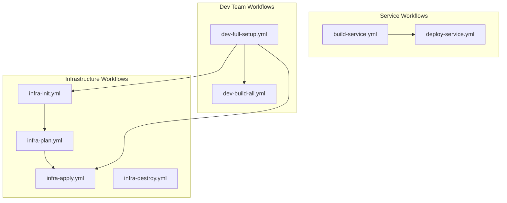

# GitHub Workflows Refactor

## README Update

Update `[README.md](README.md)` to prioritize `act` workflow at the beginning. New structure:

**New Quick Start with Act (replaces current Quick Start):**

```markdown
## Quick Start with Act

### 1. Install Act

# macOS

brew install act

# Linux

curl -s https://raw.githubusercontent.com/nektos/act/master/install.sh | sudo bash

### 2. Create Secrets File

cp .secrets.example .secrets

# Edit .secrets with your values

### 3. Full Setup (one command)

act -j dev-full-setup --secret-file .secrets

### 4. Deploy a Service

act -j deploy-service --input service=server --input version=v1.0.0
```

**Add `.secrets.example` file:**

```env
OPENAI_API_KEY=sk-your-key-here
DB_USERNAME=postgres
DB_PASSWORD=postgres
DB_NAME=devops
```

The existing `make` commands will remain as an alternative section ("Commands (Makefile)").

## Current State

Three workflows exist in `[.github/workflows/](.github/workflows/)`:

- `build.yml` - Builds services on code changes
- `deploy.yml` - Deploys services with migrations
- `infra.yml` - Manages infrastructure

These will be **completely replaced** with a new structure.

## New Workflow Architecture



## Workflow Specifications

### 1. Infrastructure Workflows

`**infra-init.yml**` - Initialize cluster and base infrastructure

- Creates Kind cluster
- Deploys namespaces (production, staging, testing)
- Sets up database and observability stack
- Inputs: `namespace` (default: production)

`**infra-plan.yml**` - Preview infrastructure changes

- Runs `terraform plan` for review
- Inputs: `namespace`

`**infra-apply.yml**` - Apply infrastructure changes

- Applies Terraform changes with auto-approve
- Inputs: `namespace`

`**infra-destroy.yml**` - Tear down infrastructure

- Destroys all resources or specific namespace
- Inputs: `namespace`, `destroy_cluster` (bool)

### 2. Service Workflows

`**build-service.yml**` - Build a service image

- Builds Docker image with specified tag
- Loads image into Kind cluster
- Inputs:
  - `service`: `server` | `web` | `resume-agent` | `migration`
  - `version`: Image tag (default: `latest`)

`**deploy-service.yml**` - Deploy service to cluster

- Deploys via Terraform with version tag
- Handles migration dependency for server
- Inputs:
  - `service`: `server` | `web` | `resume-agent`
  - `version`: Image tag (e.g., `v1.0.0`)
  - `namespace`: Target namespace

### 3. Dev Team Workflows

`**dev-full-setup.yml**` - Complete local environment setup

- Runs: init -> infra-apply -> build-all -> deploy-all
- Inputs: `namespace`

`**dev-build-all.yml**` - Build all services

- Builds all service images in parallel
- Inputs: `version` (applies to all)

## Key Implementation Details

### Version Tag Handling

Terraform variables already support versioning in `[infra/envs/production/variables.tf](infra/envs/production/variables.tf)`:

```hcl
variable "server_version" { default = "latest" }
variable "web_version" { default = "latest" }
variable "resume_agent_version" { default = "latest" }
```

Workflows will pass version via `-var` flags:

```bash
terraform apply -var="server_version=v1.0.0" ...
```

### Act Compatibility

All workflows will:

- Use `workflow_dispatch` triggers
- Include defaults for all inputs
- Use `.env` file loading for secrets
- Avoid GitHub-specific features (like `github.token`)

Example local run with `act`:

```bash
# Run with defaults
act -j deploy-service

# Run with inputs
act -j deploy-service --input service=server --input version=v1.0.0 --input namespace=staging
```

### Secrets Handling

Create `.secrets` file locally for `act`:

```env
OPENAI_API_KEY=sk-xxx
```

### Terraform tfvars Generation

Each workflow generates `terraform.tfvars` dynamically from inputs/secrets:

```yaml
- name: Generate terraform.tfvars
  run: |
    cat > infra/envs/${{ inputs.namespace }}/terraform.tfvars << EOF
    environment = "${{ inputs.namespace }}"
    openai_api_key = "${{ secrets.OPENAI_API_KEY }}"
    server_version = "${{ inputs.version }}"
    ...
    EOF
```

## Files to Delete

- `.github/workflows/build.yml`
- `.github/workflows/deploy.yml`
- `.github/workflows/infra.yml`

## Files to Create

- `.secrets.example` - Template for local secrets (for act)
- `.github/workflows/infra-init.yml` - Initialize cluster and base infra
- `.github/workflows/infra-plan.yml` - Plan infrastructure changes
- `.github/workflows/infra-apply.yml` - Apply infrastructure
- `.github/workflows/infra-destroy.yml` - Destroy infrastructure
- `.github/workflows/build-service.yml` - Build single service image
- `.github/workflows/deploy-service.yml` - Deploy single service
- `.github/workflows/dev-full-setup.yml` - Full local dev setup
- `.github/workflows/dev-build-all.yml` - Build all services

## Minor Infra Updates

Small updates to support workflow inputs (no structural changes):

- Add environment directory structure for staging/testing if missing
- Ensure `terraform.tfvars` is gitignored (secrets)

## Usage Examples

**Initialize local environment:**

```bash
act -j dev-full-setup --secret-file .secrets
```

**Deploy server v1.2.0 to staging:**

```bash
act -j deploy-service --input service=server --input version=v1.2.0 --input namespace=staging
```

**Build web with specific version:**

```bash
act -j build-service --input service=web --input version=v2.0.0
```

**Plan infrastructure changes:**

```bash
act -j infra-plan --input namespace=production
```
